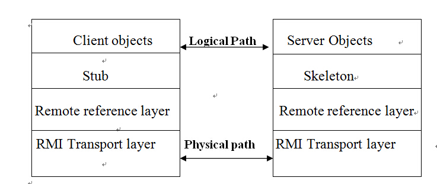

# Java RMI学习
&emsp;&emsp;闲来无事，看了《Hadoop技术内幕》中关于java rmi的介绍，觉得挺有意思的。因此想详细的了解相关的知识。在网上找了一些相关的资料学习一下。本文主要参考[JavaRMI](https://www.unf.edu/~sahuja/cnt5505/notes10-RMI.doc)中的相关内容。

## RMI简介
&emsp;&emsp;Java远程方法调用，即Java RMI（Java Remote Method Invocation）是Java编程语言里，一种用于实现远程过程调用的应用程序编程接口。它使客户机上运行的程序可以调用远程服务器上的对象。远程方法调用特性使Java编程人员能够在网络环境中分布操作。RMI全部的宗旨就是尽可能简化远程接口对象的使用。
&emsp;&emsp; Java RMI极大地依赖于接口。在需要创建一个远程对象的时候，程序员通过传递一个接口来隐藏底层的实现细节。客户端得到的远程对象句柄正好与本地的根代码连接，由后者负责透过网络通信。这样一来，程序员只需关心如何通过自己的接口句柄发送消息。Rmi的架构图如下所示：


## 开发步骤
- 定义一个远程服务接口，需要注意有两点：
 - 该接口必须继承`java.rmi.Remote`
 - 方法必须抛出`java.rmi.RemoteException`

```Java
package com.bupt.rmi.learning;
import java.rmi.Remote;
import java.rmi.RemoteException;

public interface RemoteInterface extends Remote{
    public String sayHello(String s) throws RemoteException;
}
```

- 编写实现远程接口的类，该类必须满足
 - 继承`UnicastRemoteObject`，实现接口中定义的方法。
 - 必须包含一个构造方法，在该方法中调用`UnicastRemoteObject`的构造方法。
 - 该类也可以包含其他方法，但只有远程服务接口中的方法才能参与远程方法的调用。

```Java
package com.bupt.rmi.learning;

import java.rmi.RemoteException;
import java.rmi.server.UnicastRemoteObject;

public class RemoteImpl extends UnicastRemoteObject implements RemoteInterface {
    //    构造方法
    public RemoteImpl() throws RemoteException {
        super();
    }
    //  rmi需要调用的方法
    @Override
    public String sayHello(String s) throws RemoteException {
        return "Hello" + s;
    }
    //    普通方法
    public void print(String string) {
        System.out.println(string);
    }
}
```
- 首先在idea中编译整个包，然后运行`rmic`命令，产生stub以及skeleton,对于idea工程，需要进入`/target/scala-2.10/classes`目录下，运行
```shell
rmic com.bupt.rmi.learning.Server
```
生成`RemoteImpl_Stub.class`文件
- 启动一个rmi注册表，以便驻留这些服务，在rmi中注册表中注册服务：
```
运行 rmiregistry
```
运行Server类

```Java
package com.bupt.rmi.learning;

import java.net.MalformedURLException;
import java.rmi.AlreadyBoundException;
import java.rmi.Naming;
import java.rmi.RemoteException;
import java.rmi.registry.LocateRegistry;

public class Server {
    public static void main(String[] args) throws RemoteException, AlreadyBoundException, MalformedURLException {
        LocateRegistry.createRegistry(1098);
        Naming.bind("rmi://localhost:1098/RemoteInterface",new RemoteImpl());
    }
}

```
- 客户端查找远程对象，并调用远程对象。

```java
package com.bupt.rmi.learning;

import java.net.MalformedURLException;
import java.rmi.Naming;
import java.rmi.NotBoundException;
import java.rmi.RemoteException;

public class Client {

    public static void main(String[] args) throws RemoteException, NotBoundException, MalformedURLException {

        RemoteInterface remoteInterface = (RemoteInterface)Naming.lookup("rmi://localhost:1098/RemoteInterface");
        System.out.println(remoteInterface.sayHello(" rmi"));
    }
}
```
运行结果如下所示：


## Java8 RMI调用
有上述过程可知，java 8之前的rmi调用时非常繁琐的，需要手动生成stub文件，当源文件发生变化的时候需要重新生成，使用起来非常的不方便。因此Java 8以后生成和使用骨架和静态存根已经过时，骨架不在是必须的，并且静态存根由动态存根替代。

### 使用流程
- 定义接口

```Java
package example.hello;

import java.rmi.Remote;
import java.rmi.RemoteException;

public interface Hello extends Remote {
    String sayHello() throws RemoteException;
}
```
- 编写Remote接口的实现

```Java
package example.hello;

import java.rmi.registry.Registry;
import java.rmi.registry.LocateRegistry;
import java.rmi.RemoteException;
import java.rmi.server.UnicastRemoteObject;

public class Server implements Hello {
    public Server() {}
    public String sayHello() {
        return "Hello, world!";
    }
    public static void main(String args[]) {
        try {
            Server obj = new Server();
            Hello stub = (Hello) UnicastRemoteObject.exportObject(obj, 0);
            
            // Bind the remote object's stub in the registry
            Registry registry = LocateRegistry.getRegistry();
            registry.bind("Hello", stub);

            System.err.println("Server ready");
        } catch (Exception e) {
            System.err.println("Server exception: " + e.toString());
            e.printStackTrace();
        }
    }
}
```
- Client的调用

```Java
package example.hello;

import java.rmi.registry.LocateRegistry;
import java.rmi.registry.Registry;

public class Client {

    private Client() {}

    public static void main(String[] args) {

        String host = (args.length < 1) ? null : args[0];
        try {
            Registry registry = LocateRegistry.getRegistry(host);
            Hello stub = (Hello) registry.lookup("Hello");
            String response = stub.sayHello();
            System.out.println("response: " + response);
        } catch (Exception e) {
            System.err.println("Client exception: " + e.toString());
            e.printStackTrace();
        }
    }
}
```
可以看到Java8的RMI的调用时非常简单的。


## 参考
[RMI入门教程](http://www.cnblogs.com/javalouvre/p/3726256.html)
[Java8官方文档](https://docs.oracle.com/javase/8/docs/technotes/guides/rmi/hello/hello-world.html)


