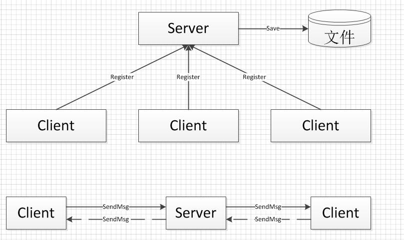
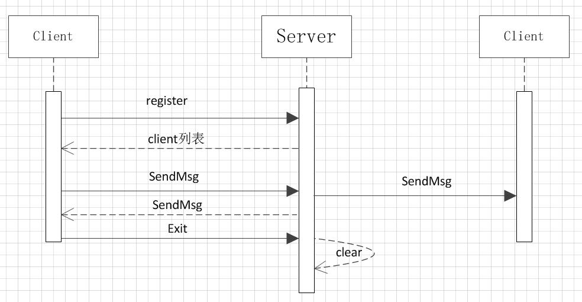

#
 Java Nio实战
## 需求
1. 使用Java Nio实现一个聊天软件，需要实现客户端与服务器之间的通信，客户端与客户端之间的通信。
2. 客户端启动的时候向服务器注册自己的ip、端口号以及名字，要求名字不能重复，否则无法注册。
2. 不要求有界面，可以在终端输入数据进行聊天。
3. 聊天程序中输入回车发送信息，输入exit退出客户端聊天程序。
3. 通过多线程测试聊天程序的性能，以TPS作为性能指标。

## 设计

1. 整体结构包含两个部分，分别是Server和Client,Server启动后再制定端口监听。Client启动之后，向指定端口发送注册请求，注册请求包含名称和ip地址，Sever接收到请求后，读取Client列表，检查对应的名称和ip是否存在，若存在则返回注册成功的信息，此时可认为Client和Server建立了连接。
2. 当系统存在两个或者多个Client的时候，Client相互之间可以通信，具体实现是，Client1与Client2通过Server建立连接。之后Client1余Client2的之间的通信都经过Sever。
3. Client断开连接的时候，需要向Server发送断开连接的请求，Server调用Clean方法，完成S断开与Client相连接的其他Client对象，并且在Client列表中删除该Client。时序图如下所示：

